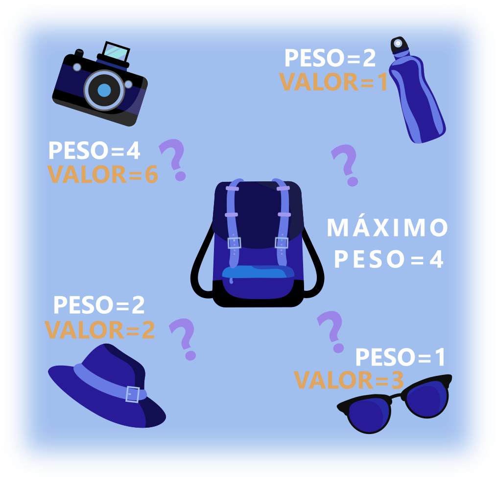

<h1 align="center">
  
</h1>

 

<h1 align="center">
  Chatbot de telegram que resolve o famoso problema da mochila
</h1>

<h3 align="center">
   Material feito para SEGEP-2020 UFTM-BR.
</h3>

  

  

  

  

  

 

# :robot: Sobre

O intuito é partir de um algoritmo (knapsack) e chegar numa aplicação que pode ser utilizada por usuários não programadores. 

Para tal, utilizou-se como interface de  comunicação com o usuário o aplicativo do Telegram. 

O usuário passa informações sobre itens, valores, pesos e capacidade da mochila e o chatbot retorna quais itens o usuário deve colocar na mochila para levar o máximo de valor possível respeitando a capacidade da mochila.

No exemplo da imagem o chatbot retorna apenas a câmera fotográfica.

<h1 align="center">
  
</h1>

 

# :iphone: Tecnologias

## Linguagem & Lib

- [Python](https://www.python.org/)
- [pyTelegramBotAPI](https://pypi.org/project/pyTelegramBotAPI/)

 

# :memo: License

Esse projeto está sob a licença MIT. Consulte [LICENSE](https://github.com/Bonizario/ecoleta/blob/master/LICENSE) para mais informações.

 

# :blue_book: Referências

- Obrigado upklyak e outros pelos vetores no [Freepik](https://br.freepik.com/)
- Binary Knapsack problem with dp solution [GeeksforGeeks](https://www.geeksforgeeks.org/0-1-knapsack-problem-dp-10/)
- Printable knapsack problem solution [GeeksforGeeks](https://www.geeksforgeeks.org/printing-items-01-knapsack/)

---

[vc]: https://code.visualstudio.com/
[vceditconfig]: https://marketplace.visualstudio.com/items?itemName=EditorConfig.EditorConfig
[vceslint]: https://marketplace.visualstudio.com/items?itemName=dbaeumer.vscode-eslint
[vcprettier]: https://marketplace.visualstudio.com/items?itemName=esbenp.prettier-vscode
